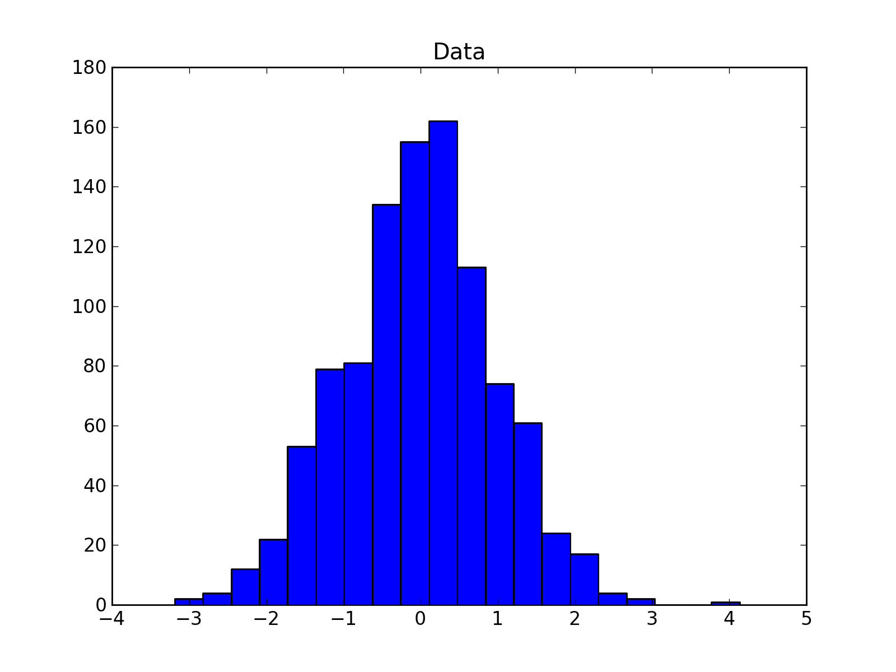

:meth:`pyvttbl.plotting.histogram_plot` Overview
=================================================

Produces a histogram plot

Example
--------------------------------

.. sourcecode:: python

    >>> from pyvttbl import DataFrame
    >>> from random import normalvariate
    >>> df['Data']=[normalvariate(mu=0, sigma=1) for i in xrange(1000)]
    >>> df.histogram_plot('Data', bins=20)

produces 'hist(data).png'

Example with `where` query
--------------------------------

.. sourcecode:: python

    >>> df.histogram_plot('Data', bins=20, 
                          where='Data > 1 or Data < -1 ', 
                          fname='hist(where_data).png')

produces 'hist(where_data).png'

.. image:: _static/hist(where_data).png 
    :width: 400px
    :align: center
    :height: 300px
    :alt: hist(where_data).png

Cumulative histogram
--------------------------------

.. sourcecode:: python

    >>> df.histogram_plot('Data', bins=20, cumulative=True,
                          fname='cumulative_hist(data).png')

                          
produces 'cumulative_hist(data).png'

.. image:: _static/cumulative_hist(data).png
    :width: 400px
    :align: center
    :height: 300px
    :alt: hist(where_data).png