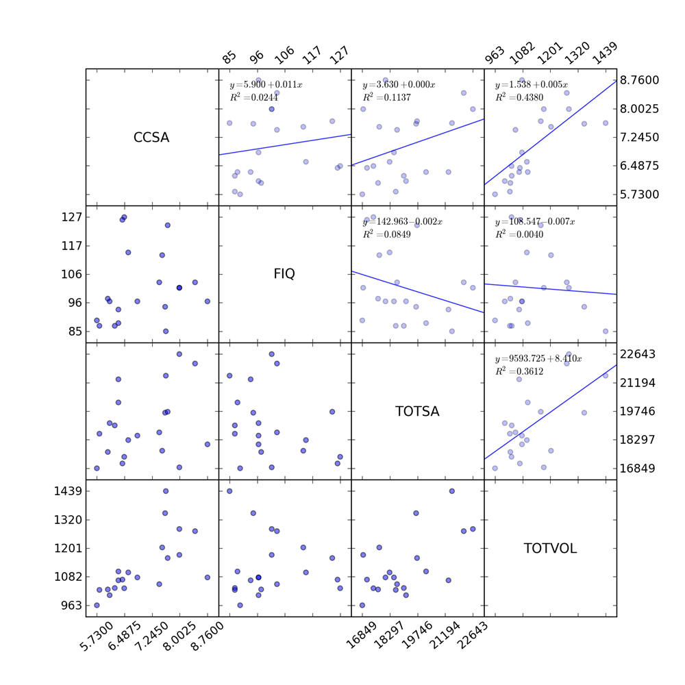
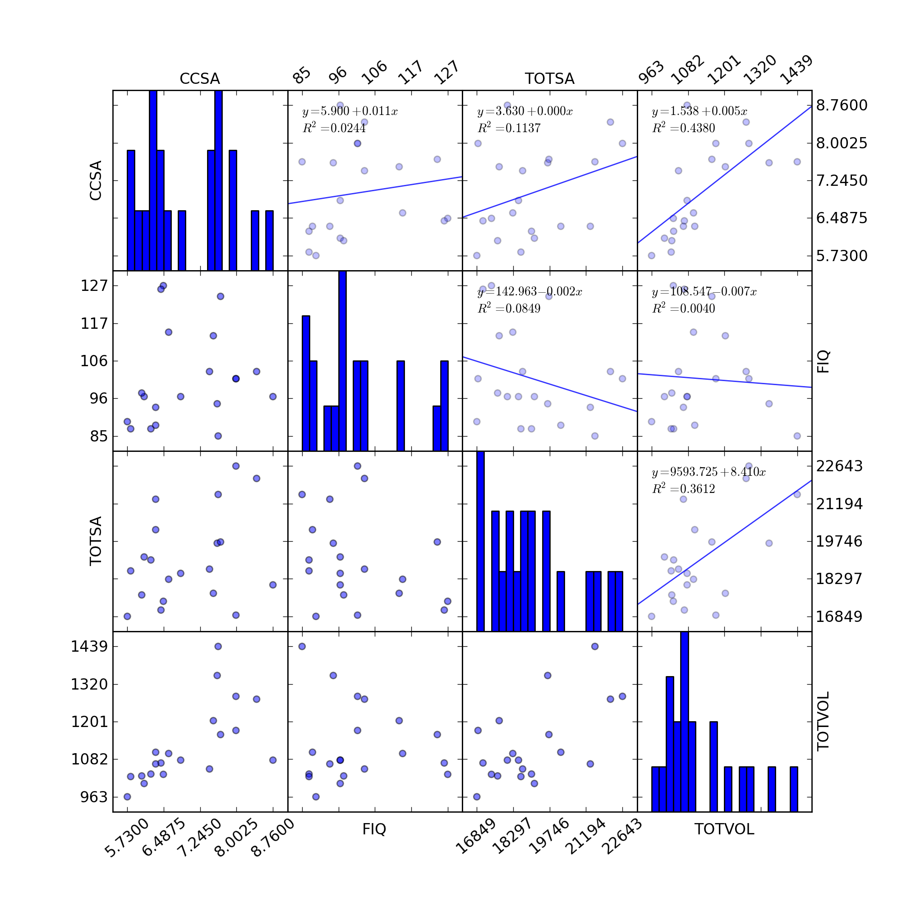
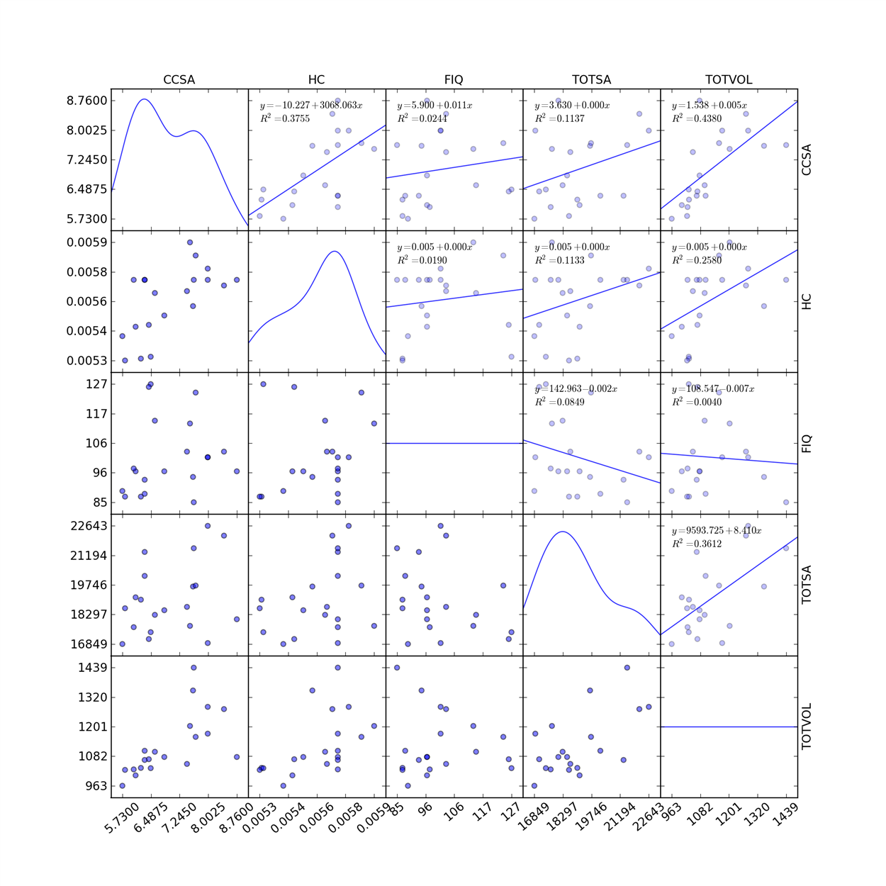

:meth:`pyvttbl.plotting.scatter_matrix` Overview
=================================================

Produces a scatter_matrix with optional trend fitting 
histograms, and Gaussian kernel density estimation.

The x-limits and y-limits are set to be 120% of the range of the data.
The subplots are also configured to be square. The plot resolution increases
with the number of variables plotted.

Example
--------------------------------

The simplest example is to load the data into a :class:`DataFrame` and
tell :meth:`scatter_matrix` what factors you would like in the matrix.

The defaults will give you factor labels down the diagonal and perform
linear trend fitting for the subplots above the diagonal.

.. sourcecode:: python

    >>> df=DataFrame()
    >>> df.read_tbl('data/iqbrainsize.txt', delimiter='\t')
    >>> df.scatter_matrix(['CCSA','FIQ','TOTSA','TOTVOL'])

produces 'scatter_matrix(CCSA_X_FIQ_X_TOTSA_X_TOTVOL).png'

Example with diagonal='hist'
------------------------------------

Specifying diagonal='hist' produces 20 bin histograms along the diagonal.
The y-axis labels do not relate to the frequency counts.

.. sourcecode:: python

    >>> df.scatter_matrix(['CCSA','FIQ','TOTSA','TOTVOL'],
                          diagonal='histogram')

produces 'scatter_matrix(CCSA_X_FIQ_X_TOTSA_X_TOTVOL,diagonal=hist).png'

    
    
Example with diagonal='kde' and alternate_labels=False
----------------------------------------------------

Specifying diagonal='kde' produces kernel density estimation plots along
the diagonal. The y-axis labels do not relate to the density estimates.

Special care was taken to make sure the appropriate labels and ticks are
plotted regardless of the number of variables or number of plots specified.
With matrices with 5 or more variables become a bit hard to reconcile with 
the alternating ticks and labels. If you would like all the ticks on to the 
left and bottom and all the variable labels to the top and right specify
just need to specify alternate_labels=False.

.. sourcecode:: python

    >>> df.scatter_matrix(['CCSA','HC','FIQ','TOTSA','TOTVOL'],
                          diagonal='histogram')

produces 'scatter_matrix(CCSA_X_HC_X_FIQ_X_TOTSA_X_TOTVOL,diagonal=kde,alternate_labels=False).png'

    
    